# Prepper

> 흩어진 레시피 링크를 한 곳에. 저장하면 요리가 되는 가장 쉬운 방법.

## 소개

유튜브나 블로그에서 찾은 레시피 링크를 붙여넣으면 재료와 조리 순서를 자동으로 정리해주는 서비스입니다.

- **유튜브 링크** — 영상 설명란과 자막에서 재료, 조리 순서 자동 파싱
- **블로그 링크** — 페이지 본문에서 레시피 정보 자동 추출
- **파싱이 어려운 경우** — 직접 수정할 수 있는 보정 화면 제공

## 주요 기능

- 링크 하나로 레시피 자동 저장
- YouTube / 블로그 출처별 분류
- 재료 및 조리 순서 자동 정리
- 확인이 필요한 레시피 별도 관리
- 레시피 상세 패널 (홈에서 바로 확인)

## 기술 스택

| 분류 | 기술 |
|------|------|
| 프레임워크 | Next.js 16 (App Router) |
| 언어 | TypeScript |
| 스타일 | Tailwind CSS v4 |
| 데이터베이스 | Supabase (PostgreSQL) |
| 인증 | Supabase Auth |
| AI 파싱 | OpenAI API |
| 모노레포 | Turborepo + pnpm |
| 배포 | AWS EC2 + Docker + GitHub Actions |

## 로컬 실행

**요구사항:** Node.js 20+, pnpm

```bash
# 의존성 설치
pnpm install

# 환경변수 설정
cp apps/web/.env.example apps/web/.env.local
# .env.local에 Supabase, OpenAI, YouTube API 키 입력

# 개발 서버 실행
pnpm dev
```

`http://localhost:3000` 에서 확인

API 서버는 별도 터미널에서 실행합니다.

```bash
cp apps/api/.env.example apps/api/.env
# apps/api/.env에 Supabase 값 입력
pnpm --filter api dev
```

`http://localhost:4000/health` 에서 확인

## Docker로 로컬 테스트

```bash
docker compose up --build
```

## 배포

`main` 브랜치에 push하면 GitHub Actions가 자동으로 배포합니다.

```
git push origin main
```

배포 흐름: GitHub Actions → Docker 빌드 → ECR push → EC2 컨테이너 교체

자세한 내용은 [`docs/deployment-2026-06.md`](docs/deployment-2026-06.md) 참고

## 프로젝트 구조

```
prepper/
├── apps/
│   ├── web/          # Next.js 웹 앱
│   └── api/          # Express API 서버
├── packages/
│   └── shared/       # 공통 타입 및 유틸
└── docs/             # 설계 문서
```

## 환경변수

| 변수명 | 설명 |
|--------|------|
| `NEXT_PUBLIC_SUPABASE_URL` | Supabase 프로젝트 URL |
| `NEXT_PUBLIC_SUPABASE_ANON_KEY` | Supabase anon 키 |
| `OPENAI_API_KEY` | OpenAI API 키 (레시피 파싱) |
| `OPENAI_MODEL` | 사용할 OpenAI 모델 (기본값: gpt-5.4-mini) |
| `YOUTUBE_API_KEY` | YouTube Data API 키 |

API 서버는 `apps/api/.env`에서 아래 값을 사용합니다. Supabase 값은 웹과 같은
`NEXT_PUBLIC_*` 이름을 그대로 사용할 수 있습니다.

| 변수명 | 설명 |
|--------|------|
| `PORT` | API 서버 포트 (기본값: 4000) |
| `NEXT_PUBLIC_SUPABASE_URL` | Supabase 프로젝트 URL |
| `NEXT_PUBLIC_SUPABASE_ANON_KEY` | Supabase anon 키 |
| `OPENAI_API_KEY` | OpenAI API 키 (레시피 파싱) |
| `OPENAI_MODEL` | 사용할 OpenAI 모델 (기본값: gpt-5.4-mini) |
| `YOUTUBE_API_KEY` | YouTube Data API 키 |


# Prepper Architecture

Prepper는 YouTube, Shorts, 블로그에 흩어진 레시피 링크를 재료와 조리순서가 정리된 레시피 카드로 변환해 저장하는 서비스입니다.

현재 구현 기준으로는 웹 앱과 모바일 앱이 같은 Supabase 데이터 모델을 사용합니다. 웹은 Next.js Server Actions로 import와 저장 흐름을 처리하고, 모바일은 별도 Express API 서버를 통해 같은 레시피 데이터를 조회, 생성, 수정, 삭제합니다.

## System Architecture

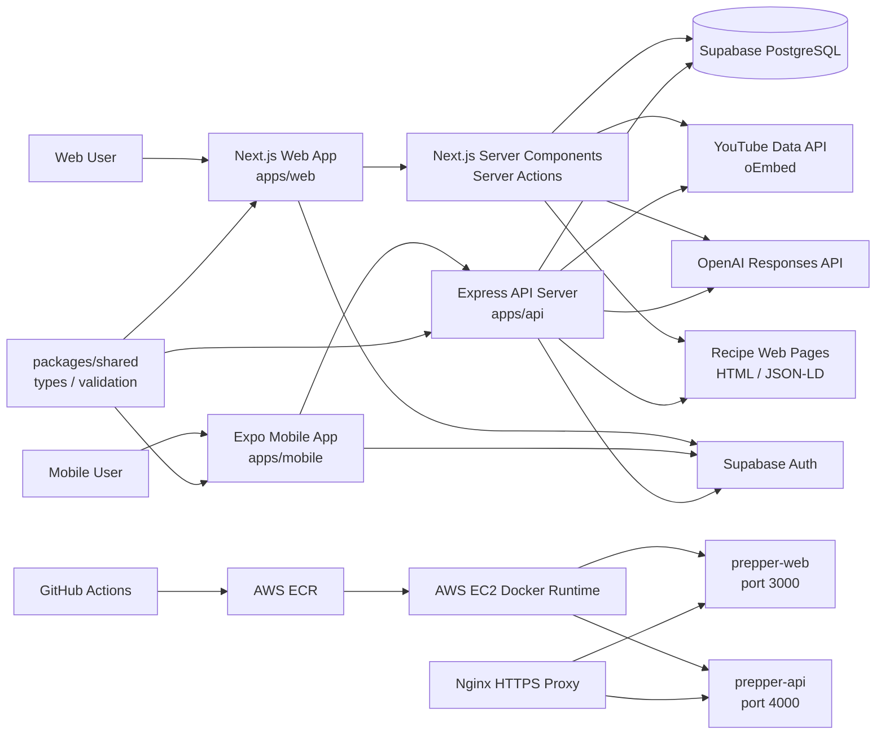

## Runtime Responsibilities

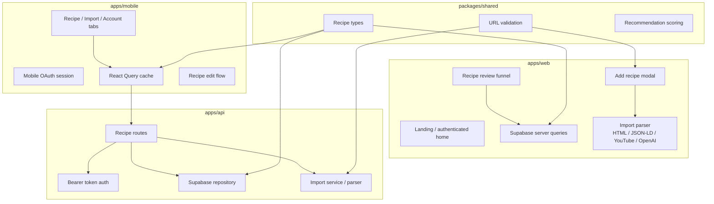

## Data Model

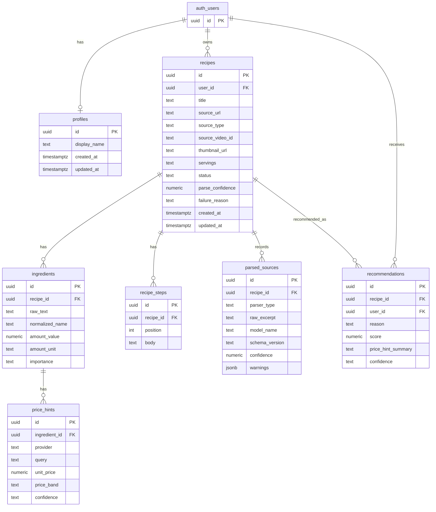

## Recipe Lifecycle

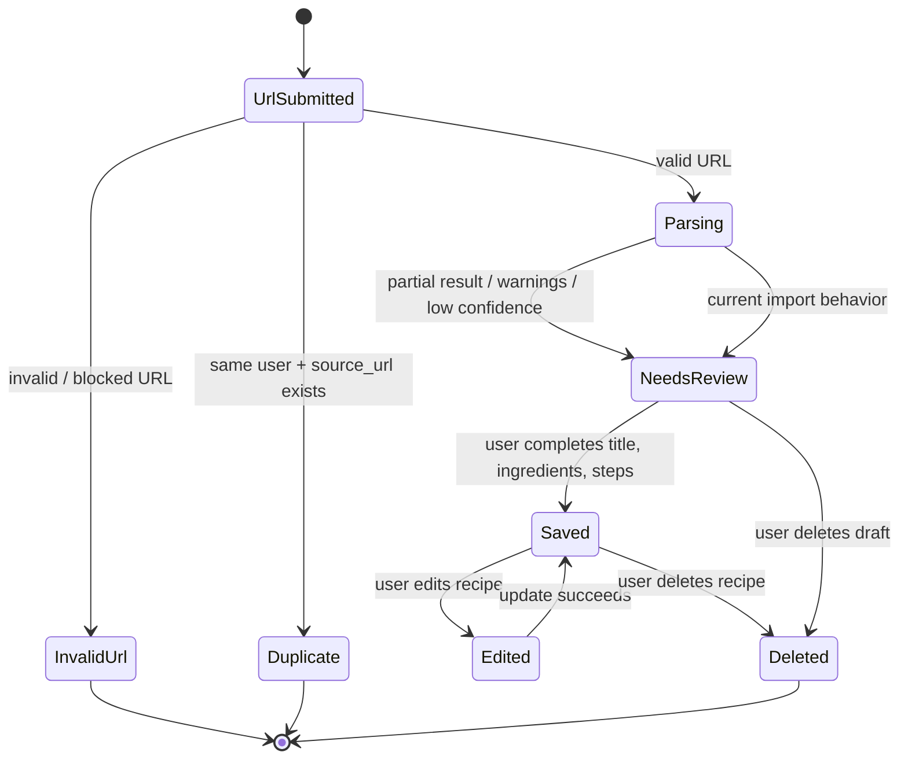

## Web Data Flow

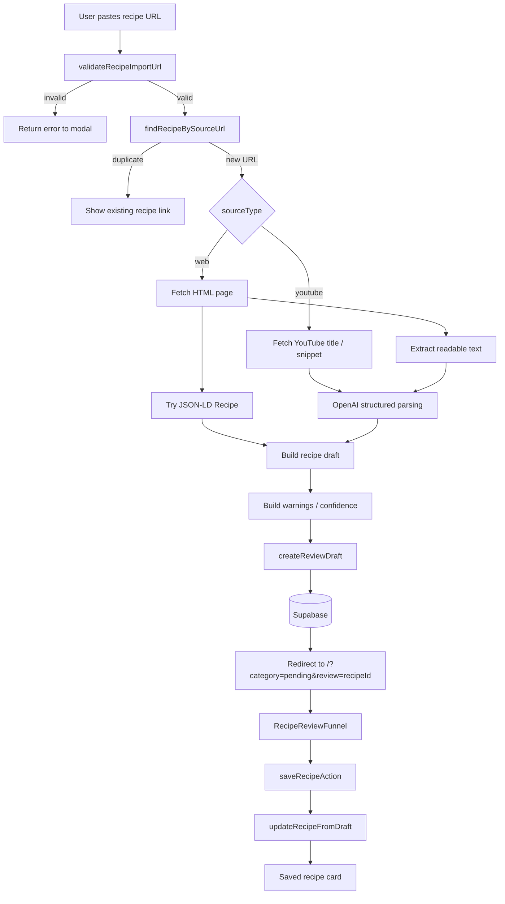

## Mobile Data Flow

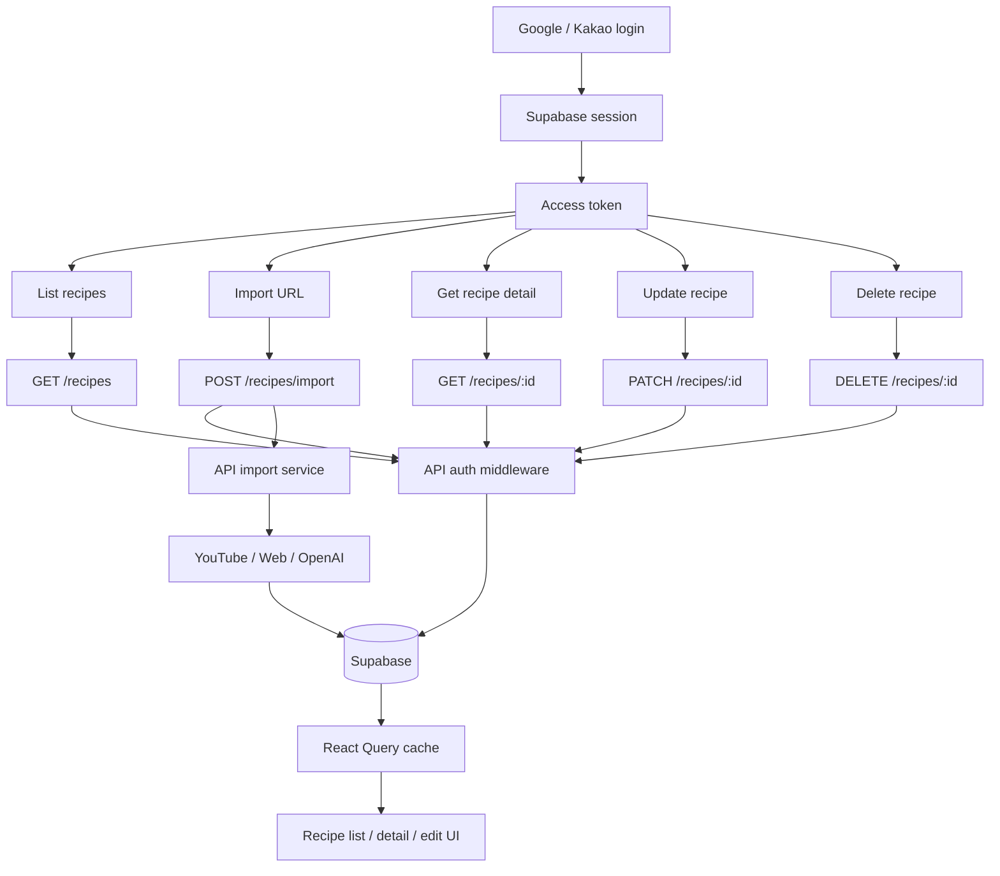

## Sequence Diagram: Web Recipe Import

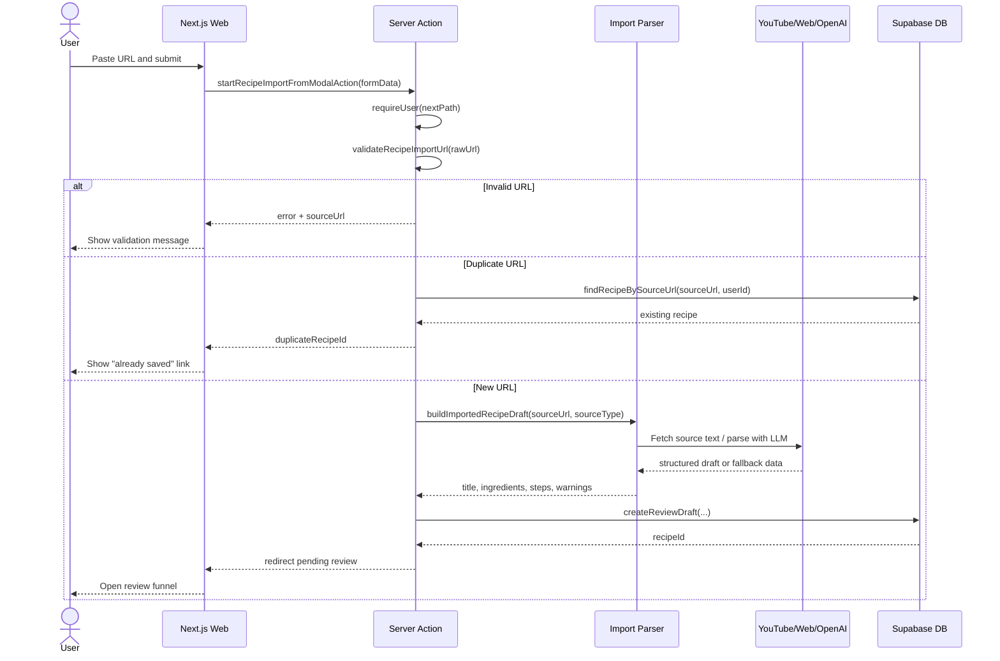

## Sequence Diagram: Web Review Save

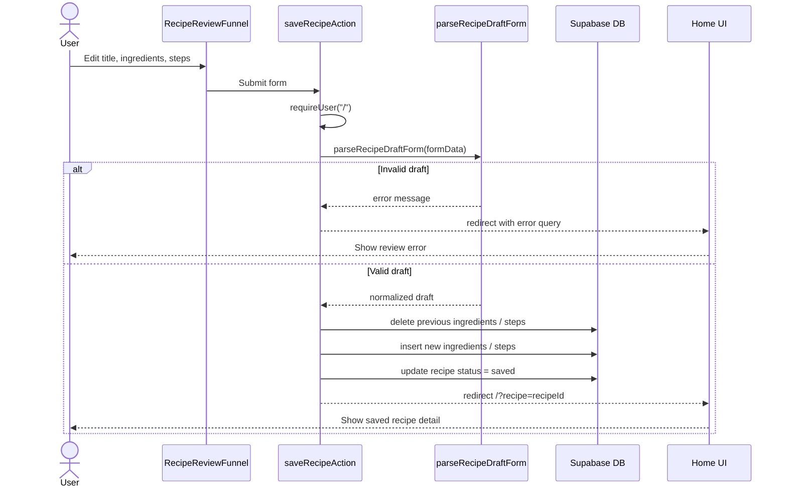

## Sequence Diagram: Mobile Import And Edit

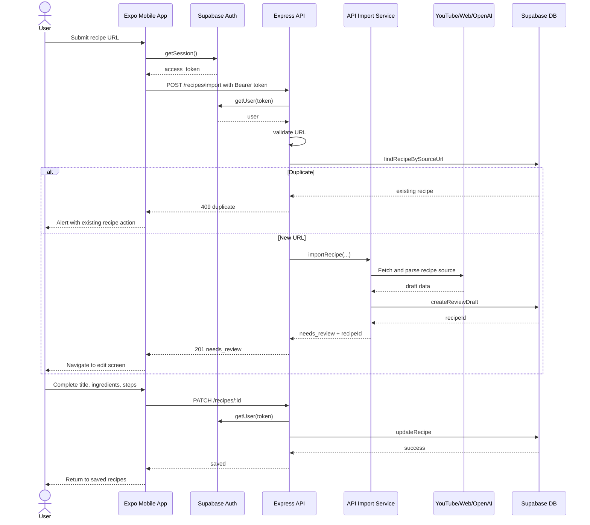

## Sequence Diagram: Mobile OAuth

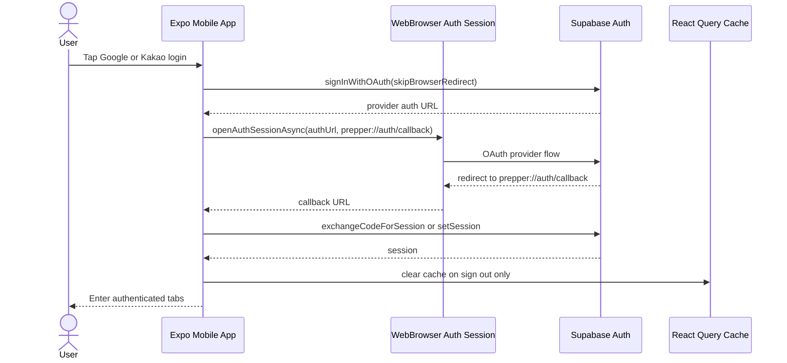

## Deployment Flow

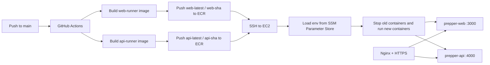

## Key Architectural Decisions

- **Web uses Server Actions for first-party flows**: the web app can validate auth, parse links, write Supabase data, and redirect without adding a client-side API layer.
- **Mobile uses Express API**: the mobile app cannot rely on Next.js Server Actions, so recipe operations are exposed through token-authenticated API endpoints.
- **Supabase owns auth and data isolation**: both clients use Supabase Auth, and recipe data is scoped by `user_id`.
- **Recipe import is intentionally staged**: imported content becomes `needs_review` first, then moves to `saved` after user confirmation.
- **Parsing is source-aware**: YouTube and web pages use different extraction strategies before falling back to structured LLM parsing.
- **Duplicate prevention happens before parsing**: same-user duplicate URLs return the existing recipe instead of spending external API calls and database writes.

## Notable Tradeoffs

- **Parser logic exists in both web and api**: this keeps web Server Actions and mobile API independent, but it creates duplication that could later move into a shared server package.
- **`needs_review` is the default safe path**: this reduces the risk of saving poor AI output as a finished recipe, but it adds one user confirmation step.
- **Supabase joins are convenient for list/detail reads**: they reduce app-side assembly work, but large recipe collections may later need pagination and narrower selects.

